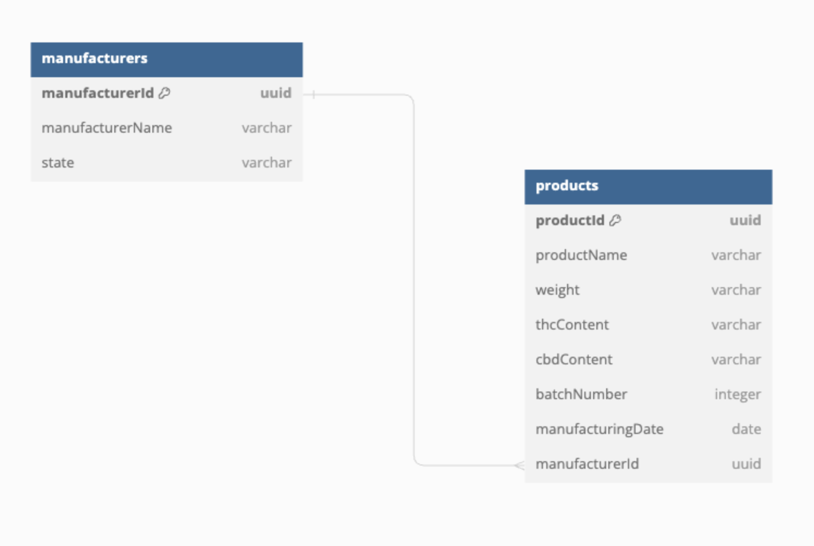

# Architecture Decision Record

## Table of Contents

1. [Assumptions](#assumptions)
2. [Architecture Decision: Runtime injection using Node modules and AWS Lambda layers](#architecture-decision-runtime-injection-using-node-modules-and-aws-lambda-layers)
3. [Architecture Decision: State configuration data schema](#architecture-decision-state-configuration-data-schema)
4. [Architecture Decision: State configuration data stored in AWS Dynamo DB](#architecture-decision-state-configuration-data-stored-in-aws-dynamo-db)
5. [Architecture Decision: Compliance Service Input/Output Data Schema](#architecture-decision-compliance-service-inputoutput-data-schema)

## Assumptions

1. There is an existing Postgres DB containing manufacturer and Product Information similar to the below schema:
   _Figure 1_  
   

2. State compliance configurations have the following schema. The config may contain additional fields based on whats required for each state:
   _Figure 2_

```
{
    "state_code": "",
    "config": {
        "stateSpecificFields":{
            "warningLabel": "",
            "governmentWarning": "",
            ...
        },
        "requiredProductInfo": [
          "productName",
          "netWeight",
          "thcContent",
          "cbdContent",
          "batchNumber",
          "manufacturingDate",
          ...
        ],
        "fieldMapping": {
            "thcContent":"thcPercentage",
            "cbdContent":"cbdPercentage",
            ...
        }
    }
}
```

3. We already have product information provided from the application consuming the compliance service in the following schema that will be passed to the Compliance Service:

```
{
    "productId": "",
    "productName": "",
    "thcContent": "",
    "cbdContent": "",
    "netWeight": "",
    "manufacturer": "",
    ...
}
```

## Architecture Decision: Runtime injection using Node modules and AWS Lambda layers

### Rationale

The service can be built as a Node module and provided as a layer to other AWS Lambda services to import and make use of. This provides a consistent, shared module that acts an abstraction layer to handle applying state specific compliance rules.

### Considerations

1. Building the service as a Node module and lamdba layer promotes modularity.
2. Packages can be published to and installed from npm promoting use across other services.
3. Providing the service as a Node module import at runtime will reduce latency compared to providing it as a web API.

## Architecture Decision: State configuration data schema

### Rationale

The state configuration data will be stored in JSON format as shown in _Figure 2_.

- `stateSpecificFields` can be used to add fields specific to a state such as warning labels to a product by providing the field name and value.
- `requiredProductInfo` is an array containing the fields that must exist and have value on a product. If any one of these fields are missing or empty, the product is noncompliant for that state.
- `fieldMapping` can be used to map the names of fields in the existing schema to that required for specific states.

### Considerations

1. The configuration file can be extended to include support for new configurations added to `config`.
2. JSON format allows us to access the configuration as an JSON object within the module.
3. Each state will have its own configuration file as opposed to one file containing all of the configurations. This was chosen as the configurations may grow very complex and placing them all in one file may impact readability and maintainability.
4. JSON files can easily be stored and queried using a NoSQL/DynamoDB.

## Architecture Decision: State configuration data stored in AWS Dynamo DB

### Rationale

Using a AWS Dynamo DB to store State Configuration Data as opposed to a PostgreSQL DB offers the following benefits:

1. Document data model - although DynamoDB doesn't offer a document model format, we can store the JSON in a string field as long as it is validated prior to being added.
2. Schema flexibility - laws and regulations may change, and new states may require additional fields we aren't aware of yet.
3. Reduced overhead - a NoSQL/DynamoDB requires less resources and could be more cost efficient.
4. Scaling - managed service enables automatic scaling with minimal configuration.

Each document will utilize the schema defined in _Figure 2_ to store the states' configuration data.

### Considerations

1. Structured data support - Postgres supports more strictly structured data and allows creating relationships between data and tables.
   1. In this case considering the evolving landscape, the configuration data does not require a strict structure therefore prioritizing the flexibility of building the config in JSON format.
   2. Simplicity is prioritized as the compliance rules don't require relationships or complex queries.
2. ACID Compliance - Postgres is Automicity, Consistency, Isolation, and Durability (ACID) compliant meaning it uses transactions for processing in a database to ensure data integrity and consistency. In this case the service is only reading the configuration, therefore read performance and flexibility is prioritized.
3. We could opt to store this in a new table in the existing PostgresDB in a `jsonb` column but in this case opted for a NoSQL for this single responsibility.
4. During the design I carefully weighed the pros and cons of DynamoDB versus DocumentDB. Although Document DB is a purpose built solution for this type of data, DynamoDB provides easier management and maintenance.
5. DynamoDB's max item size is 400kb which can support a JSON file up to ~18000 lines so field size contraints shouldn't be an issue.

## Architecture Decision: Compliance Service Input/Output Data Schema

### Rationale

The Compliance service will receive two parameters: `states` and `productInfo`. `states` is a string array of the states to apply the rules for, and `productInfo` is a JSON object containing the product information to map:

```
{
    "productId": "",
    "productName": "",
    "thcContent": "",
    "cbdContent": "",
    "netWeight": "",
    "manufacturer": "",
    ...
}
```

The Compliance service will output the `productInfo` in the below format where `states` is an array containing the product information mapped to each states required compliant field. `isCompliant` can be used to indicate if any one of the required fields is missing indicating that the product is not compliant in that state:

```
{
    "productId": "",
    "states": [{
        "state": "",
        "isCompliant": true,
        "requiredProductInfo": {
            "warningLabel": "",
            "governmentWarning": "",
            "productName": "",
            "netWeight": "",
            "thcContent": "",
            "cbdContent": "",
            "batchNumber": "",
            "manufacturingDate": "",
            "manufacturer": ""
        }
    }]
}
```

1. Compliance rules can be applied for multiple states at once improving the scalability of the service.
2. Providing the `isCompliant` field allows for the abstraction of indicating if the product is compliant in that state based on if any of the `requiredProductInfo` is missing - eliminating the need to build this capability in other parts of the system.
